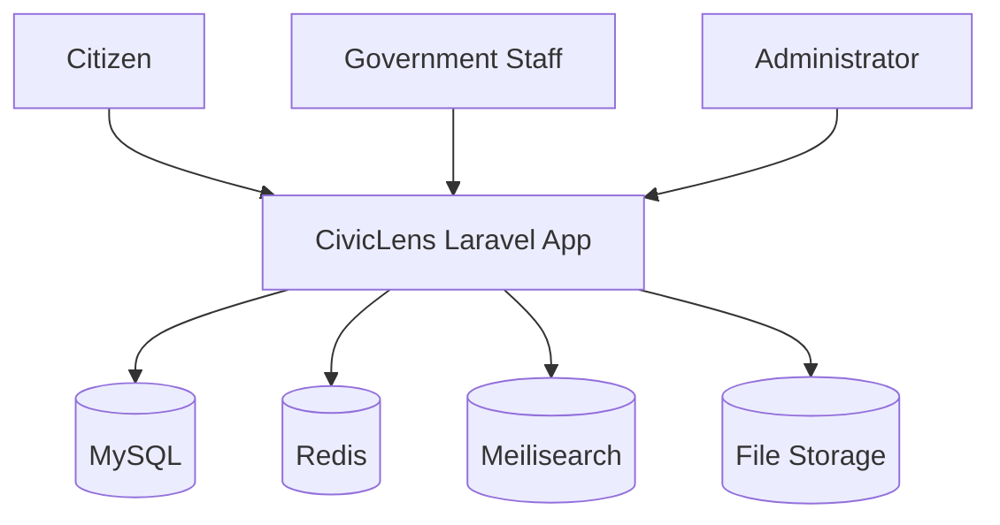

# 03 System Architecture

## Architecture Summary

CivicLens v1 is a modular Laravel application backed by MySQL, Redis, and Meilisearch. The platform is organized around domain modules: users, agencies, projects, budgets, procurements, documents, reports, search, analytics, and audit logs.

## Context Diagram

## Module Boundaries

- Projects own project lifecycle and status.
- Agencies own organization metadata.
- Procurement owns plans, tenders, bid workflow, evaluations, awards, contracts, milestones, variations, payments, closeouts, and procurement activities.
- Search owns provider-agnostic indexing, discovery, suggestions, history, saved searches, analytics, and knowledge graph traversal.
- Analytics owns cross-module metric calculation, dashboards, snapshots, reports, alerts, and chart-ready definitions while reading source facts from operational modules.
- Intelligence owns deterministic rule execution, evidence-backed risk indicators, human review, processing readiness, and reproducible Civic Integrity Engine runs. It does not run OCR, LLMs, embeddings, vector search, semantic search, or autonomous agents in v1.

## Sprint 08 Search Infrastructure

Universal Search is implemented as platform infrastructure behind `Searchable` and `SearchProvider` contracts. Business modules expose their own search payloads and relationships; controllers call `SearchManager`, `SearchIndexingService`, or `KnowledgeGraphService` instead of provider clients.

The current provider is `DatabaseSearchProvider`. Future Scout, Meilisearch, and OpenSearch providers must remain interchangeable behind `SearchProvider`.

## Sprint 09 Analytics Infrastructure

Business Intelligence is implemented as a dedicated Analytics module. `MetricRegistry` registers metrics by key, `MetricEngine` calculates cached metric values, `AggregationEngine` centralizes source-record filters, and `DashboardService` composes dashboard payloads.

Analytics persistence is limited to immutable snapshots, generated report records, rule definitions, triggered alerts, dashboard states, and analytics events. Operational facts remain owned by projects, finance, procurement, contractors, documents, search, identity, agencies, and geography.

## Sprint 11 Public Transparency Infrastructure

Public Transparency is implemented as a public-safe web layer over existing source domains. Public controllers call dedicated services for visibility checks, listing, detail composition, search, document downloads, and citizen report workflow. Citizen report records and activities are their own moderated domain and do not replace project, procurement, document, or analytics facts.

## Sprint 12 Procurement Lifecycle Infrastructure

Enterprise Procurement extends the existing Sprint 05 source tables through services, Form Requests, policies, and workflow routes. `ProcurementPlanningService` owns plan creation and approval. `ProcurementLifecycleService` owns bid opening, evaluation finalization, award approval, contract payment recording, milestone completion, variation approval, and contract closeout. `EnterpriseProcurementAnalyticsService` calculates procurement intelligence metrics from operational records without persisting duplicate source facts.

Procurement plans implement `Searchable` and are registered in the provider-agnostic search registry. Public procurement pages expose only active public tenders and approved awards whose disclosure status is public.

## Sprint 13 Production Readiness and Civic Integrity Engine

Sprint 13 part 1 adds a production deployment scaffold and deterministic integrity analysis without changing module ownership. Docker, Nginx, PHP-FPM, Supervisor, Redis, MySQL, queue worker, scheduler, production PHP settings, `.env.production.example`, and `/healthz` support deployment verification. The scheduler runs `civiclens:integrity-run` daily, and queue workers are expected to be supervised in production.

`CivicIntegrityEngineService` coordinates active `IntelligenceRule` records through the existing `RuleExecutionService`. Each run stores engine version, status, threshold snapshots, rules executed, indicators created, and summary payload in `civic_intelligence_runs`. Indicators generated by the engine are tagged through metadata and still flow through the existing evidence, search, knowledge graph, and human review architecture.

## V2 Expansion Notes

Add OCR workers, vector search, map services, and public API gateways behind clear interfaces.
