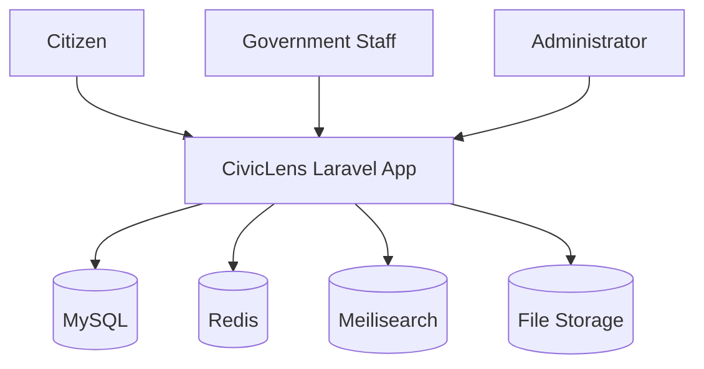

# 03 System Architecture

## Architecture Summary

CivicLens v1 is a modular Laravel application backed by MySQL, Redis, and Meilisearch. The platform is organized around domain modules: users, agencies, projects, budgets, procurements, documents, reports, search, analytics, and audit logs.

## Context Diagram

## Module Boundaries

- Projects own project lifecycle and status.
- Agencies own organization metadata.
- Procurement owns plans, tenders, bid workflow, evaluations, awards, contracts, milestones, variations, payments, closeouts, and procurement activities.
- Search owns provider-agnostic indexing, discovery, suggestions, history, saved searches, analytics, and knowledge graph traversal.
- Analytics owns cross-module metric calculation, dashboards, snapshots, reports, alerts, and chart-ready definitions while reading source facts from operational modules.
- Intelligence owns deterministic rule execution, evidence-backed risk indicators, human review, processing readiness, and reproducible Civic Integrity Engine runs. It does not run OCR, LLMs, embeddings, vector search, semantic search, or autonomous agents in v1.

## Sprint 08 Search Infrastructure

Universal Search is implemented as platform infrastructure behind `Searchable` and `SearchProvider` contracts. Business modules expose their own search payloads and relationships; controllers call `SearchManager`, `SearchIndexingService`, or `KnowledgeGraphService` instead of provider clients.

The current provider is `DatabaseSearchProvider`. Future Scout, Meilisearch, and OpenSearch providers must remain interchangeable behind `SearchProvider`.

## Sprint 09 Analytics Infrastructure

Business Intelligence is implemented as a dedicated Analytics module. `MetricRegistry` registers metrics by key, `MetricEngine` calculates cached metric values, `AggregationEngine` centralizes source-record filters, and `DashboardService` composes dashboard payloads.

Analytics persistence is limited to immutable snapshots, generated report records, rule definitions, triggered alerts, dashboard states, and analytics events. Operational facts remain owned by projects, finance, procurement, contractors, documents, search, identity, agencies, and geography.

## Sprint 11 Public Transparency Infrastructure

Public Transparency is implemented as a public-safe web layer over existing source domains. Public controllers call dedicated services for visibility checks, listing, detail composition, search, document downloads, and citizen report workflow. Citizen report records and activities are their own moderated domain and do not replace project, procurement, document, or analytics facts.

## Sprint 12 Procurement Lifecycle Infrastructure

Enterprise Procurement extends the existing Sprint 05 source tables through services, Form Requests, policies, and workflow routes. `ProcurementPlanningService` owns plan creation and approval. `ProcurementLifecycleService` owns bid opening, evaluation finalization, award approval, contract payment recording, milestone completion, variation approval, and contract closeout. `EnterpriseProcurementAnalyticsService` calculates procurement intelligence metrics from operational records without persisting duplicate source facts.

Procurement plans implement `Searchable` and are registered in the provider-agnostic search registry. Public procurement pages expose only active public tenders and approved awards whose disclosure status is public.

## Sprint 13 Production Readiness and Civic Integrity Engine

Sprint 13 part 1 adds a production deployment scaffold and deterministic integrity analysis without changing module ownership. Docker, Nginx, PHP-FPM, Redis, MySQL, dedicated queue-worker and scheduler roles, production PHP settings, `.env.production.example`, and `/healthz` support deployment verification. The scheduler runs `civiclens:integrity-run` daily, and `/nginx-healthz` remains separate from dependency diagnostics.

`CivicIntegrityEngineService` coordinates active `IntelligenceRule` records through the existing `RuleExecutionService`. Each run stores engine version, status, threshold snapshots, rules executed, indicators created, and summary payload in `civic_intelligence_runs`. Engine-generated indicators are linked by a nullable foreign key and retain their legacy metadata tag for payload compatibility, then flow through the existing evidence, search, knowledge graph, and human review architecture. `IntelligenceCandidateQueryService` supplies stably ordered source candidates for both execution and dry-run estimates so their deterministic matching logic cannot drift. Execution is capped at 25 candidates per rule; dry-run payloads retain their full estimate and add the cap, capped count, and truncation state.

Sprint 13 part 2 hardens the same architecture with additive production services instead of parallel systems. `ExecutiveDashboardService` composes the authenticated command center from existing source modules, analytics, search, integrity runs, and `SystemMetricsService`. `SystemMetricsService` owns `/healthz`, `/version`, and authorized `/admin/system/metrics` payloads. `RuleManagementService` owns audited rule configuration updates, dry-run estimation, and execution metadata while `intelligence_rule_audits` preserves rule-change history.

Report generation remains inside the Analytics module through `ReportBuilder`, which now emits CSV, spreadsheet-compatible, and PDF payloads from stored dashboard payloads and evidence metadata. Request correlation is middleware-owned and adds `X-Request-Id` to responses and structured log context.

## V2 Expansion Notes

Add OCR workers, vector search, map services, and public API gateways behind clear interfaces.

## V2 Governed Source Acquisition

The ingestion module extends the document boundary rather than replacing it. `source_publishers` and `source_endpoints` define administrator-approved government and non-government sources. `SourceConnector` implementations discover resources through API/feed, sitemap, direct-download, static-HTML, or an isolated browser provider. `RunSourceEndpointCrawl` records a crawl run and dispatches separately rate-limited `FetchDiscoveredResourceArtifact` jobs.

`ApprovedSourceUrlGuard` requires HTTPS, exact endpoint host allowlisting, public DNS results, and standard ports. `SafeHttpTransport` pins the resolved public address when cURL is available, revalidates every redirect, disables automatic redirects, bounds response bytes, and accepts only safe conditional headers. `SecureArtifactFetcher` checks the declared and detected media types and requires malware status `clean` before an artifact can leave quarantine.

`source_artifact_versions` is the private immutable acquisition ledger. Content-addressed paths, SHA-256 uniqueness, and `supersedes_id` preserve changed publisher versions without duplicating unchanged content. Stage 4 may link an accepted artifact to an existing `document_version`; no acquisition record directly mutates projects, budgets, procurement, contractors, agencies, or public projections.

## V2 Native Extraction and Page Routing

Extraction reads native content before considering OCR. `NativeExtractorRegistry` selects an implementation of `NativeTextExtractor` by media type: `PdfNativeTextExtractor` shells out to poppler through `Symfony\Component\Process` with array arguments, no shell interpolation, and a configured timeout; `PlainTextNativeExtractor` handles text, HTML, CSV, XML, and JSON in process. `pdfinfo` supplies the authoritative page count and page geometry, and `pdftotext` emits the whole document in one call with pages separated by form feeds.

`NativeExtractionService` copies the artifact from its private disk into a short-lived `0600` temporary file, so extraction never assumes a local filesystem path and no storage path reaches a caller or a failure message. Quarantined artifacts are refused outright. Failures mark the run `failed` with a generic reason and still record `completed_at`.

`PageRoutingPolicy` decides per page whether the text layer is usable. The metric is characters per square inch rather than a raw character count, because a sparse A3 page and a dense A5 page can carry identical character counts while meaning opposite things. The threshold is configuration, not a constant — it is an operating point that has to be reported and varied rather than assumed, and `civiclens:extraction-summary` prints it alongside every result.

`ScriptClassifier` labels each page `bn`, `en`, `mixed`, or `unknown` from Unicode ranges alone. The label is deliberately independent of extraction confidence: a page's script is a property of the document, not of how well an engine read it, and group-conditional calibration later partitions on this value.

Runs and pages land in the extraction measurement spine. `ExtractionRoutingReport` derives the born-digital share, which is the denominator for every later OCR claim — the share of pages that never need OCR and, inverted, the share of compute an OCR-always pipeline spends for nothing.

## V2 Selective OCR and Abstention

`SelectiveOcrService` runs only on pages the native routing could not satisfy. Each page is rasterized by `PageRasterizer` through poppler and recognized by an `OcrEngine`; `TesseractOcrEngine` is the default binding and parses Tesseract's TSV output, averaging confidence over recognized words only. Structural TSV rows report `-1` and are excluded, because averaging them in would drag every page toward a meaningless figure.

Exactly one enhanced pass is permitted, at higher resolution and a different page-segmentation mode. A page still below the acceptance threshold **abstains**: the confidence is recorded, a reason is stored, and no text is kept. An abstention is a recorded outcome, not a failure — the pipeline declines to contribute text nobody vouched for rather than publishing a low-confidence guess. The better of the two confidences is retained on the abstained row so the calibration record shows how close the page came.

`OcrPageResult::$meanConfidence` is null when nothing was recognized, deliberately distinct from a confidence of zero. "The engine saw nothing" and "the engine saw something and doubted it" are different events, and only the second is a calibration signal.

The acceptance threshold is configuration. `civiclens:extraction-summary` reports it alongside the abstention rate, the enhanced-pass recovery rate, and the confidence distribution **per script class** — pooled figures can look healthy while a low-resource subset fails, which is the same reason calibration has to be group-conditional.

## V2 Group-Conditional Conformal Calibration

`ConformalCalibrator` fits a split-conformal acceptance threshold over `extraction_fields`, separately for each publisher x script group. `FieldDecisionService` applies those thresholds and records an accept or defer decision with the alpha in force.

**What is guaranteed.** For a field drawn exchangeably from the same group as its calibration set, the construction controls the false acceptance rate `P(field auto-accepted AND wrong) <= alpha`. That is an unconditional joint probability. It is deliberately not `P(wrong | accepted)`, which is a ratio of two random quantities and is not what this bounds; the conditional rate is computed and reported as an empirical diagnostic, never as a guarantee.

**Why a field-level loss.** Sequence metrics such as character error rate are non-decomposable and cannot carry a distribution-free bound. A per-field 0/1 loss is bounded and decomposable, so the standard conformal risk control argument applies — and field correctness is also the quantity governance depends on.

**Why per group.** A threshold fitted across every publisher and script at once can report a healthy pooled rate while a low-resource subset fails badly, because the majority group dominates the average. On a representative corpus the pooled threshold satisfied alpha overall at 0.048 while the Bengali subgroup realized 0.525 — an order of magnitude over the same alpha, hidden entirely by the aggregate. Group-conditional calibration brought that subgroup to 0.025.

**Small groups.** The finite-sample correction contributes `1/(n+1)` to the risk bound, so a group with fewer than `1/alpha - 1` calibration examples cannot satisfy it at any threshold. Such a group is reported as uncertifiable and every field in it is deferred. This is the Mondrian small-group problem stated exactly, and it constrains low-resource groups first, which is why it is surfaced rather than smoothed over.

Decisions deny by default: a missing group, an uncertifiable group, or a missing score all defer to a human. `civiclens:calibration-report` prints the per-group thresholds, the uncertifiable groups, and the realized risk of both strategies on held-out data.

## V2 Benchmark Evaluation

`BenchmarkEvaluationService` turns a gold-annotated corpus into real calibration data. Until it exists every calibration figure is synthetic: the conformal machinery can be validated, but no empirical claim can be made about any document population.

Benchmarks are **referenced, never vendored**. `BenchmarkManifestReader` reads a manifest that names page images relative to its own directory, so a corpus that cannot be redistributed — BaFCo is CC-BY-NC-4.0, not the CC BY 4.0 its paper page suggests — stays outside the repository while its structure stays reproducible from a committed manifest. A manifest is treated as data, not instructions: image paths are resolved with `realpath` and refused if they escape the manifest directory, because the manifest may be authored by whoever published the benchmark.

Each gold field becomes one `extraction_fields` row carrying a genuine prediction, outcome, and nonconformity score derived from the real OCR pass. `FieldValueMatcher` locates the shortest run of recognized words backing a value and scores the field by that span's **weakest** word, not the page average. A field is only as trustworthy as its least legible word: one garbled digit makes an amount wrong, and averaging hides it. Page-level confidence is unusable here — it ties every field on a page to one score, and conformal calibration can only accept or reject a run of ties whole, so a single page of errors is admitted at the first candidate threshold and no threshold ever satisfies the bound.

`FieldValueMatcher` normalizes conservatively — case folding, Unicode whitespace collapsing, and Bengali-to-ASCII digit folding, nothing more. Fuzzy matching or punctuation stripping would manufacture agreement the engine did not earn, and the calibration guarantee is only as honest as this comparison.

**Known limitation: the current harness cannot support a calibration claim.** It locates the gold value inside recognized text, so a field is correct exactly when a span exists and has a score exactly when it is correct. The score is therefore a function of the label rather than an independent prediction, and any guarantee computed on it is vacuous. `CalibrationReport` reports a `label_leakage` check that detects this signature — no incorrect field scoring below the worst correct field — and it fires on the real BaFCo run. A usable evaluation needs a key-to-value extractor that proposes a candidate without consulting the gold value.

A benchmark run is not an acquisition, so `extraction_runs.source_artifact_version_id` is nullable and the run records which `benchmark` it came from. Borrowing an artifact row would put a fabricated acquisition record in the provenance ledger.

## Change-Request Governance and Citizen Safety

Staff submit structured change proposals through the Change Request module; administrators remain the only users who mutate operational source records. A proposal can be reviewed and then marked as applied only after the administrator completes the normal source-record workflow. This marker writes an immutable proposal audit activity and never applies payload data automatically.

Citizen dashboard and search requests remain on the public-safe read path. The citizen dashboard contains only the citizen's own reports and aggregate public counts. Authenticated administrators and staff retain their permission-aware internal search path.

Project map editing is part of the Projects workflow at `/admin/projects/map`. Legacy Geography Project Map URLs redirect for compatibility, while Geography reference tables remain operational but are not primary navigation.

Public detail maps use the same read-only Leaflet component as workspace views. Projects use their exact coordinates and otherwise fall back to assigned geography. Agencies can store direct coordinates and GeoJSON. Contractor maps prefer public headquarters coordinates and otherwise use active branch-office coordinates.

Contractor detail maps may include multiple public-safe branch markers. Internal and public map views share the same component but receive only the locations authorized for their scope.

Portfolio map data is served by `ProjectMapQueryService` through bounded public and authorized admin JSON endpoints. The public response has an explicit property allowlist and includes only public, active, unarchived projects with complete authoritative latitude/longitude pairs. The portable latitude/longitude query path is authoritative across supported databases; a nullable, MySQL-only SRID 4326 `POINT` column is synchronized as an additive optimization, while a B-tree `(latitude, longitude, id)` index supports the portable query path.
