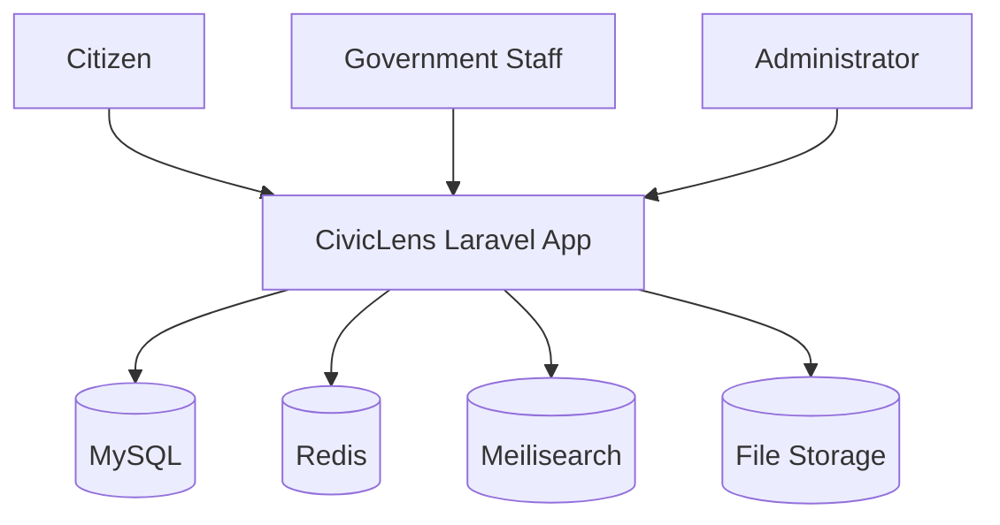

# 03 System Architecture

## Architecture Summary

CivicLens v1 is a modular Laravel application backed by MySQL, Redis, and Meilisearch. The platform is organized around domain modules: users, agencies, projects, budgets, procurements, documents, reports, search, analytics, and audit logs.

## Context Diagram

## Module Boundaries

- Projects own project lifecycle and status.
- Agencies own organization metadata.
- Procurement owns suppliers, contracts, and procurement items.
- Search indexes public searchable records.
- Intelligence stays isolated until v2 features are promoted by ADR.

## V2 Expansion Notes

Add OCR workers, vector search, map services, and public API gateways behind clear interfaces.

