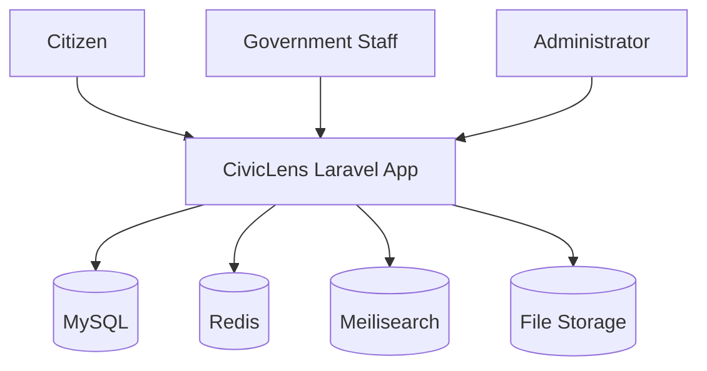

# 03 System Architecture

## Architecture Summary

CivicLens v1 is a modular Laravel application backed by MySQL, Redis, and Meilisearch. The platform is organized around domain modules: users, agencies, projects, budgets, procurements, documents, reports, search, analytics, and audit logs.

## Context Diagram

## Module Boundaries

- Projects own project lifecycle and status.
- Agencies own organization metadata.
- Procurement owns suppliers, contracts, and procurement items.
- Search owns provider-agnostic indexing, discovery, suggestions, history, saved searches, analytics, and knowledge graph traversal.
- Analytics owns cross-module metric calculation, dashboards, snapshots, reports, alerts, and chart-ready definitions while reading source facts from operational modules.
- Intelligence stays isolated until v2 features are promoted by ADR.

## Sprint 08 Search Infrastructure

Universal Search is implemented as platform infrastructure behind `Searchable` and `SearchProvider` contracts. Business modules expose their own search payloads and relationships; controllers call `SearchManager`, `SearchIndexingService`, or `KnowledgeGraphService` instead of provider clients.

The current provider is `DatabaseSearchProvider`. Future Scout, Meilisearch, and OpenSearch providers must remain interchangeable behind `SearchProvider`.

## Sprint 09 Analytics Infrastructure

Business Intelligence is implemented as a dedicated Analytics module. `MetricRegistry` registers metrics by key, `MetricEngine` calculates cached metric values, `AggregationEngine` centralizes source-record filters, and `DashboardService` composes dashboard payloads.

Analytics persistence is limited to immutable snapshots, generated report records, rule definitions, triggered alerts, dashboard states, and analytics events. Operational facts remain owned by projects, finance, procurement, contractors, documents, search, identity, agencies, and geography.

## V2 Expansion Notes

Add OCR workers, vector search, map services, and public API gateways behind clear interfaces.
