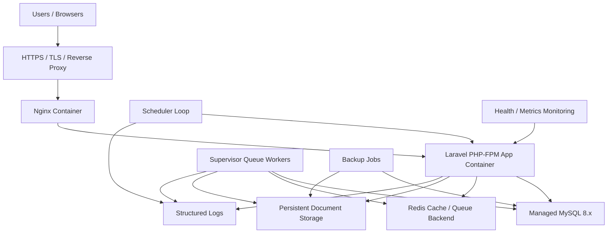

# CivicLens RC1 Deployment Strategy

## Environment Discovery

Discovery was performed before any deployment attempt. No secret values were printed or stored.

### MCP Servers

| Capability | Status | Notes |
| --- | --- | --- |
| GitHub MCP | Available | Authenticated as `shadowfax-505`; useful for repository operations. |
| Higgsfield MCP | Available but not selected | Website deployment tools target React/TanStack/Cloudflare Worker templates, not this existing Laravel monolith. `_list_websites` returned HTTP 422 during discovery. |
| Codebase Memory MCP | Available | Indexed CivicLens for architecture-aware code discovery. |
| Context7 MCP | Available | Can provide framework documentation when implementation changes are required. |
| Cavemem MCP | Available | Can read project memory. |
| Docker/Vercel/Railway/Render/Fly/DigitalOcean/AWS/Azure/GCP/Neon/Supabase/PlanetScale/Cloudflare/Coolify MCP | Not discovered | No callable production deployment MCP was exposed for these providers. |

### Local Provider And CLI Inventory

| Provider / Tool | Status | Notes |
| --- | --- | --- |
| GitHub CLI | Available and authenticated | Repo: `shadowfax-505/CiviLens`; token scopes include `repo`. |
| GitHub Actions | Available for CI only | Workflow `CivicLens CI` exists; no deployment secrets or variables are configured. |
| Docker CLI | Available after Docker Desktop startup | Used for RC1 local production-style validation. |
| Docker Compose | Unavailable | `docker compose` is not installed/enabled in this local CLI. |
| Kubernetes CLI | Installed, not connected | `kubectl` has no current context. |
| Azure | Incomplete local profile only | VS Code Azure auth files exist, but `az` CLI is missing and no Azure env credentials are set. |
| MySQL CLI | Installed | Local client only; no managed database provider credentials discovered. |
| Vercel/Railway/Fly/DigitalOcean/AWS/GCP/Supabase/Neon/PlanetScale/Render/Cloudflare/Coolify/Heroku | Not available | CLIs missing and provider tokens unset. |
| Monitoring providers | Not available | No Sentry, Honeybadger, or New Relic tokens discovered. |
| Storage providers | Not available | No S3-compatible bucket credentials discovered. |

### Repository Deployment Artifacts

The repository already contains production-oriented deployment assets:

- `Dockerfile`
- `docker-compose.production.yml`
- `docker/production/nginx.conf`
- `docker/production/supervisord.conf`
- `docker/production/php.ini`
- `docker/production/entrypoint.sh`
- `.env.production.example`

These assets define the intended runtime: PHP-FPM Laravel app, Nginx, MySQL, Redis, database-backed queue fallback, supervised workers, scheduler loop, and persistent storage.

## Deployment Target Decision

### Provider Comparison

| Target | Fit For CivicLens | Current Availability | Decision |
| --- | --- | --- | --- |
| Higgsfield website deploy | Poor | MCP available | Rejected. The platform creates Cloudflare Worker React apps and is not appropriate for this Laravel/MySQL/Redis monolith. |
| GitHub Pages | Poor | GitHub available | Rejected. Static hosting cannot run Laravel, queues, scheduler, MySQL, Redis, or private storage. |
| GitHub Actions deployment | Conditional | CI available, no deployment secrets | Not currently deployable. Suitable later as automation once a host and secrets exist. |
| Local Docker | Good for release validation, poor as public production | Docker daemon available; Compose unavailable | Used for manual local production-style validation. Not a replacement for public HTTPS hosting. |
| Kubernetes | Conditional | CLI installed, no cluster context | Not currently deployable. Suitable only with a configured cluster, ingress, database, Redis, storage, and secrets. |
| Managed VPS or container host with Docker Compose | Best architectural fit | No connected provider | Selected strategy, blocked by missing production host/credentials. |
| AWS ECS/Fargate, DigitalOcean App/Droplet, Render, Railway, Fly.io | Good to strong | No credentials/tools discovered | Viable future targets; cannot be used in this environment now. |

### Selected Strategy

The selected production strategy is a Dockerized Laravel deployment on a managed VPS/container host with managed MySQL, managed Redis where possible, durable object/file storage, HTTPS termination, supervised workers, scheduler, backups, and external log/metrics collection.

External production deployment is currently blocked because no Laravel-capable production provider, host, cluster, registry, managed database, managed Redis, durable storage, DNS, TLS, or monitoring credentials are connected in this environment. The application container stack was validated locally with Docker using manually started MySQL, Redis, PHP-FPM, Supervisor, and Nginx containers.

## Infrastructure Diagram

## Deployment Flow

1. Build release from the RC1 branch or tag.
2. Run CI quality gates.
3. Build the Docker image from `Dockerfile`.
4. Push the image to the chosen registry.
5. Provision MySQL, Redis, storage, and secrets.
6. Deploy app, worker, scheduler, and Nginx/reverse-proxy services.
7. Run migrations with `php artisan migrate --force`.
8. Cache config, routes, and views.
9. Restart queue workers and scheduler.
10. Verify `/healthz`, `/version`, `/admin/system/metrics`, authentication, writes, reads, queues, cache, storage, and browser workflows.

## Runtime Architecture

- PHP 8.4 production image.
- Laravel app served through PHP-FPM.
- Nginx terminates HTTP inside the container stack or receives traffic from an external HTTPS proxy.
- `APP_DEBUG=false`.
- `APP_ENV=production`.
- `APP_VERSION=v1.0.0-RC1`.
- `APP_COMMIT=<release sha>`.

## Database Architecture

- MySQL 8.x is the source-of-truth database.
- Production should use managed MySQL or a dedicated MySQL volume with automated backups.
- Migrations must run once during deployment.
- Restore drills must validate login, dashboard, documents, reports, search, and integrity workflows.

## Cache Architecture

- Redis is the preferred production cache store.
- Cache must be reachable before app health can be considered production-ready.
- Configuration cache and route cache must be compiled after environment variables are injected.

## Queue Architecture

- Queue workers run under Supervisor or the host platform's worker process manager.
- `queue:work --sleep=3 --tries=3 --max-time=3600` is the current worker command.
- Failed jobs must be observable through Laravel's failed-jobs storage.
- Workers must restart after every deployment.

## Scheduler Architecture

- Scheduler runs every minute and executes Laravel scheduled tasks.
- `civiclens:integrity-run` is scheduled daily at `02:15`.
- Scheduler logs must be captured and monitored.

## Storage Architecture

- RC1 defaults to local document storage.
- Production should mount durable storage or configure an S3-compatible disk before accepting user uploads.
- Storage backups must be coordinated with database backups.

## Logging Architecture

- Use structured Laravel logs with request/correlation IDs.
- App, worker, and scheduler logs must be collected centrally.
- Logs must not include secrets, raw environment dumps, passwords, tokens, or private storage paths.

## Monitoring Architecture

- Public-safe health endpoint: `/healthz`.
- Deploy metadata endpoint: `/version`.
- Administrative metrics endpoint: `/admin/system/metrics`.
- External monitoring should poll `/healthz` and alert on non-200 responses.
- Authenticated operational monitoring should verify queue, scheduler, cache, database, storage, and latest integrity run status.

## Backup Strategy

- Schedule daily MySQL backups with retention.
- Schedule durable storage backups with retention.
- Capture backup success/failure logs.
- Store backups outside the primary host.
- Test restores before approving live production traffic.

## Rollback Strategy

- Keep the previous release image/artifact available.
- Keep the previous `.env.production` secret set versioned outside Git.
- Before destructive migrations, take a database backup.
- Roll back by restoring the previous image, clearing optimized caches, restarting workers, and validating health/version endpoints.
- If schema rollback is unsafe, restore the latest verified backup into a clean database and repoint the app.

## Disaster Recovery Strategy

- Recovery point objective: latest verified database and storage backup.
- Recovery time objective: provision replacement host, restore DB/storage, deploy previous known-good image, run health/browser smoke tests.
- Minimum restore validation: authentication, dashboard, public portal, document download, search, reports, integrity dashboard, queue job processing, scheduler execution.

## Production Verification Plan

After deployment, verify:

- Authentication and session persistence.
- Authorization failures for restricted routes.
- Dashboard, search, filtering, sorting, reports, exports, integrity engine, notifications, settings, dark mode, and responsive layout.
- Database writes and reads.
- Queue job dispatch and completion.
- Scheduler execution.
- Cache and Redis operations.
- Uploads and downloads.
- `/healthz`, `/version`, and `/admin/system/metrics`.
- Cookies, CSRF behavior, secure session flags, and HTTPS redirect behavior.

## RC1 Local Production-Style Validation

On July 4, 2026, the RC1 image and runtime stack were validated locally with Docker because Docker became available after initial discovery. Docker Compose remained unavailable, so services were started manually on an isolated `civiclens-rc1` network with named volumes.

Validation results:

- `civiclens:rc1` built successfully on PHP 8.4.23 with Redis, PDO MySQL, intl, mbstring, opcache, and zip extensions.
- Laravel booted inside the production image with no dev dependencies.
- MySQL 8.4 migrations ran from an empty schema and seeders completed.
- Nginx served the app on `http://localhost:8080`.
- `/healthz` returned `ok` with database, Redis cache, storage, queue, scheduler, and integrity checks.
- `/version` returned `v1.0.0-RC1`, `production`, and deploy-safe commit metadata.
- Authentication, CSRF, encrypted sessions, dashboard, procurement, analytics, search, public procurement, public search, and admin metrics were smoke-tested through Nginx.
- A database-backed queue job was dispatched and processed by Supervisor-managed workers with zero failed jobs.
- `civiclens:integrity-run` completed with 12 rules executed and 2 indicators created.
- Supervisor reported two queue workers and the scheduler as `RUNNING`.

RC1 hardening fixes from this validation:

- Updated the production Docker image to PHP 8.4 and installed the Redis extension.
- Excluded and removed copied Laravel bootstrap cache artifacts from production images.
- Shortened MySQL index identifiers that exceeded MySQL's 64-character limit.
- Moved runtime storage ownership repair into the entrypoint for mounted volumes.
- Aligned Nginx security headers and hid duplicate upstream headers.
- Changed analytics metric caching to store arrays instead of serialized PHP objects.
- Added Supervisor control socket configuration for operator status checks.

## Current Deployment Decision

CivicLens RC1 is validated for a Dockerized Laravel runtime, but do not mark public production deployment complete from this environment yet. The remaining blocker is external infrastructure: no public HTTPS host, DNS, managed database, durable storage, backup service, or monitoring provider is connected.

Minimum remediation before production deployment:

1. Connect a Laravel-capable production provider or provide SSH/registry credentials for a managed host.
2. Provide production MySQL, Redis, durable storage, DNS, TLS, and monitoring configuration.
3. Configure GitHub Actions or host-native deployment secrets.
4. Start/enable a Docker-compatible build environment or use provider-native image builds.
5. Re-run the RC1 release checklist against the target environment.
