# CivicLens v2 Implementation Blueprint

## Purpose

CivicLens v2 turns the stable v1 civic-data platform into a multilingual, geography-aware public evidence system. It expands the product without weakening v1 authorization, source-of-truth tables, audit history, or deterministic intelligence.

The mission is to help people inspect public delivery and raise evidence-backed concerns. CivicLens may surface irregularity indicators, but it must not declare corruption, guilt, fraud, or legal wrongdoing.

## Product Invariants

- Preserve the Laravel modular monolith, MySQL operational store, Redis queues, Blade, Tailwind, and Alpine.
- Keep source records, extracted text, model outputs, reviewer decisions, subject responses, and public projections separate.
- Publish only through an explicit, auditable human-review workflow.
- Prefer precision and abstention over speculative coverage.
- Keep every public summary short, neutral, source-attributed, and linked to the publisher's original page.
- Treat official and non-governmental sources as distinct evidence classes; never imply that one independently confirms the other unless the records actually agree.
- Retain acquired source snapshots privately for reproducible extraction, change detection, review, and audit; never expose a private snapshot as a public download without an explicit rights decision.
- Do not collect NID documents, NID numbers, NID-derived metadata, or NID hashes. Account trust uses verified email, optional two-factor authentication, and account history.
- Do not retain precise browser coordinates. Resolve location ephemerally and store only district preferences selected by an authenticated user.
- No production workflow depends on a privately owned high-end GPU.

## Release Train

### Stage 0 — Stable base

- Preserve v1.0.0 and maintain a separately releasable v1.0.1 stabilization branch.
- Require Laravel, browser, static-analysis, build, cache, and dependency-audit gates.
- Keep generated workspace artifacts outside product commits.

### Stage 1 — Contracts and boundaries

- Accept the v2 publication, OCR, geospatial privacy, and heterogeneous-source ADRs.
- Define additive schemas and state machines before migrations.
- Threat-model ingestion, document parsing, reviewer blindness, subject response, and publication.

### Stage 2 — v2A public experience

- Use one document scroll with a sticky nine-stage Earth-to-Dhaka journey; never trap scrolling inside the globe.
- Retain the static and reduced-motion fallbacks and the rollout flag.
- Give public visitors one primary action: **Explore my district**.
- Separate citizen, staff, and administrator navigation, dashboards, information density, and actions while sharing design tokens and accessible components.
- Add a recently indexed public timeline with type, geography, publisher, date, and source filters.

### Stage 3 — v2B source ingestion

- Introduce an allowlisted source registry for government, nonprofit, research, watchdog, and other public-interest publishers.
- Discover resources through APIs or feeds first, then sitemaps and direct downloads, static HTML, and isolated browser rendering only for approved JavaScript-only sources.
- Crawl only public resources under documented rate limits, robots/terms decisions, retry budgets, content-size limits, host/path allowlists, redirect validation, and SSRF controls.
- Store an immutable acquisition record, checksum, retrieval metadata, declared license, source class, and original URL.
- Preserve checksum-protected private artifact versions, deduplicate unchanged content, and record supersession when publisher content changes.
- Quarantine malformed, unexpectedly large, redirected-to-unapproved, structurally changed, or unsafe content before parsing.

### Stage 4 — v2B document extraction

- Extract native HTML, PDF, Office, CSV, JSON, XML, metadata, and tables before OCR.
- Run CPU-first Tesseract `ben+eng` for Bangla, English, and mixed documents.
- Send only scanned or low-text pages to OCR, permit one enhanced second pass for low-confidence pages, then abstain to manual review.
- Keep layout, table, page-image, and text extraction as versioned outputs of an extraction run.
- Run parsers and future vision models in isolated workers with no application secrets, tools, or unrestricted network access.

### Stage 5 — review and publication governance

- Assign two reviewers who make initial decisions blindly.
- Require agreement; otherwise assign an independent blind tie-break reviewer.
- Use a seven-day reviewer SLA with escalation and reassignment.
- Keep named-subject material private for a 30-calendar-day response window.
- If notice cannot be delivered, retain privacy and allow a renewed deadline.
- Publish only reviewer-approved neutral summaries and public evidence links.
- Mark corrections prominently as **under re-review** while retaining the prior public version and audit history.

### Stage 6 — governed model shadow pilot

- Evaluate an open-source multilingual vision/language model only in shadow mode.
- Train only on licensed public data, synthetic data, and corrections explicitly approved for training.
- Require evidence spans, calibrated uncertainty, reproducible model/version metadata, and an abstain path.
- Treat self-critique as one model process, not independent verification.

### Stage 7 — controlled release

- Release by source cohort, geography, and document type behind flags.
- Monitor provenance completeness, OCR quality, reviewer agreement, correction rate, queue latency, and publication reversals.
- Roll back public projections without deleting source, review, or audit records.

## Target Data Flow

```mermaid
flowchart LR
    A["Allowlisted public publisher"] --> B["Rate-limited acquisition"]
    B --> C["Immutable source artifact"]
    C --> D["Versioned extraction run"]
    D --> E["Evidence spans and structured facts"]
    E --> F["Deterministic or model candidate"]
    F --> G["Two blind reviews"]
    G --> H{"Agreement?"}
    H -- "No" --> I["Blind tie-break review"]
    H -- "Yes" --> J["Subject response window when named"]
    I --> J
    J --> K["Versioned public projection"]
    K --> L["Recently indexed timeline and district explorer"]
```

## Source Contract

Every acquired resource must record:

- publisher identity and source class;
- canonical original URL and retrieval URL;
- publication date, observed date, retrieved date, and HTTP metadata;
- declared license or rights status and the decision that permits indexing;
- media type, byte size, checksum, language hints, and geographic hints;
- acquisition method, crawler version, retry count, and immutable artifact reference;
- supersession relationship when a publisher changes or removes a document.

The immutable artifact is private by default. Public pages display publisher attribution, a short approved summary, metadata, and the original publisher link. CivicLens does not republish full third-party documents unless the license and publication policy explicitly allow it.

## Geographic Contract

- The public map supports national, division, district, upazila, union, and ward references when the source supports that precision.
- Geographic claims carry their derivation method: publisher metadata, detected place text, matched administrative code, or human correction.
- Conflicting or ambiguous locations remain unresolved until review.
- Browser geolocation is opt-in. Coordinates are used in memory only to suggest a district and are then discarded.
- Dhaka is the anonymous/default journey destination. Signed-in users may store one or more district IDs as preferences.

## Compute Contract

Development can use heterogeneous lab computers as independent queue workers. Each worker advertises CPU, RAM, GPU model, VRAM, supported runtimes, and current load. The scheduler assigns whole OCR or evaluation jobs that fit one worker; it does not assume unrelated GPUs can combine their VRAM.

Distributed training is optional and requires compatible machines, a fast network, repeatable environments, checkpointing, and explicit dataset governance. When unavailable, use CPU OCR, small-model fine-tuning, quantization, gradient accumulation, and rented accelerator bursts without changing application contracts.

## Quality Gates

- Provenance completeness: 100% for public items.
- Public summaries without completed review: 0.
- Reviewer blindness breaches: 0.
- Precise browser coordinates persisted: 0.
- Public source links resolving to the original publisher: 100% at publication time.
- Unchanged acquisitions creating duplicate artifact versions: 0.
- Crawler requests escaping approved public hosts or reaching private/link-local networks: 0.
- OCR quality measured separately for Bangla, English, mixed text, tables, scans, and native PDFs.
- Accessibility: keyboard, touch, reduced motion, dark mode, and WCAG 2.2 AA checks on every public critical path.
- Security: parser isolation, upload/content limits, SSRF controls, malware scanning, authorization regression tests, and immutable audit events.

## Current Implementation Checkpoint

- Complete: clean v1 stabilization base, secure dependency locks, permission-safe public visibility, and staff proposal access.
- Complete: locally packaged Cesium, validated gap-free NASA imagery, fail-closed imagery refresh, permission-safe public markers, and static fallback.
- Complete: normal page scrolling drives the exact nine-stage Earth journey on desktop and mobile.
- Complete: shared semantic UI foundations with distinct public, citizen, staff, and administrator shells.
- Complete: interaction-gated ephemeral location resolution, Dhaka fallback, and authenticated district-ID preferences without coordinate retention.
- Complete: the compatibility recently-indexed read model over existing public-safe projects, procurement, and documents, including validated type, district, publisher, date, and source-class filters.
- Next: the governed source registry, immutable acquisition ledger, connector jobs, and publisher-backed timeline projection before native extraction or OCR execution.
